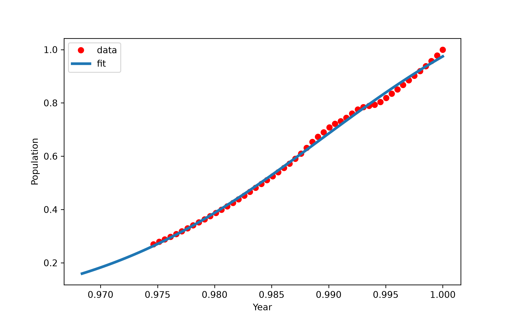

# 📈 Population Growth Prediction using Sigmoid Regression

<p align="center">
  
</p>

A machine learning project that models long-term population growth using **Non-linear (Sigmoid) Regression**. The model is trained on historical population data and learns the characteristic S-shaped growth curve commonly observed in demographic studies.

This project demonstrates how **SciPy's curve fitting** can be used to estimate the parameters of a sigmoid function and model real-world population growth trends.

---

## 📌 Project Overview

Population growth rarely follows a perfectly linear pattern. In many countries, population increases rapidly during development and gradually stabilizes as growth slows down. This behavior can often be approximated by a **sigmoid (logistic) curve**.

In this project:

* Historical population data was extracted from the World Bank dataset.
* Data for **Tajikistan** was selected.
* A sigmoid regression model was fitted using **SciPy's `curve_fit()`**.
* Model performance was evaluated on a held-out test set.

---

## 📂 Dataset

**Source:** World Bank Population Dataset

The dataset contains historical population records for countries around the world.

For this project, only the records corresponding to **Tajikistan** were used.

---

## ⚙️ Technologies Used

* Python
* NumPy
* Pandas
* Matplotlib
* SciPy
* Scikit-learn
* Jupyter Notebook

---

## 🔬 Project Workflow

1. Load and inspect the dataset
2. Select Tajikistan population records
3. Split data into training and testing sets
4. Normalize training data
5. Fit a sigmoid function using `scipy.optimize.curve_fit`
6. Predict population values
7. Evaluate model performance
8. Visualize the fitted curve

---

## 📊 Model Performance

| Metric   |           Value |
| -------- | --------------: |
| MAE      |         274,843 |
| MSE      | 105,662,496,432 |
| RMSE     |         325,058 |
| R² Score |        **0.84** |

The sigmoid regression model successfully captured the long-term population growth trend, achieving an **R² score of 0.84** on the held-out test set. The relatively low prediction error indicates that the model is able to approximate the historical growth pattern with good accuracy while preserving the characteristic S-shaped behavior of population growth.

---

## 📈 Visualization

The notebook includes visualizations of:

* Historical population data
* Fitted sigmoid curve
* Model predictions versus actual observations

> *(Insert the final prediction plot here)*

```text
images/population_growth_fit.png
```

---

## 📁 Repository Structure

```
population-growth-sigmoid-fit/
│
├── dataset/
│   └── population.csv
│
├── notebook/
│   └── population_growth_sigmoid.ipynb
│
├── images/
│   └── population_growth_fit.png
│
├── README.md
└── requirements.txt
```

---

## ▶️ Running the Project

Clone the repository

```bash
git clone https://github.com/MohammadNasrollahiCE/population-growth-sigmoid-fit.git
```

Install dependencies

```bash
pip install -r requirements.txt
```

Run the notebook

```bash
jupyter notebook
```

---

## 🎯 Learning Outcomes

Through this project I practiced:

* Non-linear Regression
* Sigmoid Curve Fitting
* Mathematical Modeling
* Data Normalization
* Model Evaluation
* Regression Performance Metrics
* Scientific Computing with SciPy

---

## 📌 Future Improvements

* Implement a complete Logistic Growth model with carrying capacity *(K)*.
* Forecast future population values.
* Compare Sigmoid Regression with Polynomial Regression.
* Evaluate additional non-linear growth models.

---

## 📜 License

This project is intended for educational and portfolio purposes.

